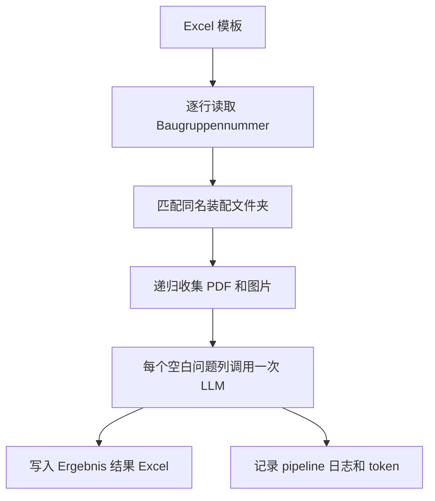

# KI-API 文件夹说明与文件分类

> 用途：记录 Bosch LLM Farm 相关脚本、测试文件和 `Extraction-Pipeline` 的关系，便于以后快速判断“哪个文件做什么、应该运行哪个文件”。
>
> 本文根据当前文件夹、README 和代码截图整理。模型可用性与模型 ID 会变化，正式运行前应以内部 Model Farm 文档和一次小规模测试为准。

## 1. 一句话理解整个文件夹

`KI-API` 不是一个单一程序，而是一套 **Bosch LLM Farm 的 Python 示例、连接器、模型测试和技术文档处理流程**。

它大致包含两代代码：

1. **外层旧版/示例代码**：每个模型通常有一个独立脚本，用来测试文本、图片或 PDF。
2. **内层新版 `Extraction-Pipeline/`**：使用统一的 `llm_connector.py`，可以在 Gemini、Claude 和 GPT 之间切换，并把装配技术文档的分析结果写回 Excel。

此外，功能分类脚本 `run_classification.py` 是另一个业务入口：它预测一个 `Funktionsklasse`，不等同于这里的元数据提取。

---

## 2. 推荐先记住的文件

| 想做的事情 | 推荐文件 |
|---|---|
| 测试 API Key 是否可用 | 外层 `Test.py` |
| 用旧版 Gemini 连接器分析多个文件 | `Google_native_connector_multiplefiles_1.py` |
| 运行旧版 Excel 批处理实验 | `Experimente_Anja 1.py` |
| 运行新版元数据提取 | `Extraction-Pipeline/main.py` |
| 修改/扩展不同模型的连接方式 | `Extraction-Pipeline/llm_connector.py` |
| 查看新版 Pipeline 用法 | `Extraction-Pipeline/README.md` |
| 做 BG 功能分类 | RepoMA 中的 `scripts/run_classification.py` |

日常情况下，不需要逐个运行外层的 Claude、DeepSeek、Mistral 和 GPT 示例文件。它们主要用于模型试验、故障排查和代码参考。

---

## 3. `KI-API` 顶层文件分类

### 3.1 环境与配置

| 文件/文件夹 | 作用 | 是否应提交到公开仓库 |
|---|---|---|
| `.venv/` | 本机 Python 虚拟环境及已安装依赖 | 否 |
| `.vscode/` | VS Code 工作区配置，例如解释器和编辑器设置 | 视内容而定 |
| `.env` | 保存 `BOSCH_FARM_SUBSCRIPTION_KEY` 等本机配置 | **绝对不要提交** |
| `.gitignore` | 指定 Git 应忽略的密钥、输出、缓存等文件 | 是 |
| `README.md` | 顶层 Connector Suite 的总说明 | 可保留脱敏版 |

推荐只在公开仓库中提供不含真实值的 `.env.example`：

```env
BOSCH_FARM_SUBSCRIPTION_KEY=<your-key>
BG_DATA_ROOT=<your-local-data-folder>
```

### 3.2 内部资料和测试文档

| 文件 | 作用 | 注意事项 |
|---|---|---|
| `Bosch Model Farm.docx` | 内部模型能力、PDF支持、模型 ID 和端点参考 | 内部资料，不建议上传公开仓库 |
| `Example BOM.pdf` | BOM 文档分析测试输入 | 上传前确认是否允许公开 |
| `Example Drawing.pdf` | 技术图纸/多模态分析测试输入 | 上传前确认是否允许公开 |
| `test.md` | 多模型实际测试报告，记录成功/失败、模型 ID 和回答 | 是测试快照，不是永久有效的模型目录；不建议公开上传原文 |

`test.md` 的作用是回答：“某个模型在当时的 Bosch Farm 环境中能否连接、能否读取 BOM、是否需要把 PDF 转成图片”。它不能保证未来仍然可用。

### 3.3 单模型测试脚本

| 文件 | 主要用途 | 定位 |
|---|---|---|
| `Test.py` | 使用小模型发送简单 Hello 请求，快速检查 API 连接 | 最小连接测试 |
| `Claude Haiku 4.5.py` | 用 Claude Haiku 对 PDF 做交互式问答 | Claude 示例 |
| `Claude Models Probe.py` | 批量探测多个 Claude 模型名称/版本是否可用 | 模型 ID 排查工具 |
| `Claude Opus 4.8.py` | 使用 Claude Opus 分析文档 | 高能力但可能较慢 |
| `Claude Sonnet 5.py` | 使用 Claude Sonnet 分析文档 | Claude 新模型示例 |
| `DeepSeek R1.py` | DeepSeek R1 文本推理测试 | 当前测试显示不适合图片/PDF输入 |
| `Mistral OCR 2 (25.05).py` | Mistral OCR/PDF 实验 | 当前 Bosch ChatCompletion 端点测试不兼容 |
| `bosch_llm_connector_multimodal_gpt.py` | 旧版 GPT 文本+单图片连接器 | 示例/旧代码，不是新版统一连接器 |
| `GPT-5-5.py` | GPT-5.5 文本、图片和 PDF 实验 | GPT 专用实验脚本 |
| `llm_pdf_tester.py` | README 中所称的 GPT-5.5“最终版”文本/图片连接器 | 文件名容易误导；当前说明称其没有统一的 PDF 分析方法 |
| `run_all_t...py` | 截图中名称未完全显示，可能是批量运行测试的辅助脚本 | 使用前先打开确认，不作为核心入口 |

这些文件大多是彼此独立的实验脚本，因此会重复出现：

- API 客户端初始化；
- Base64 编码；
- PDF/图片载入；
- Prompt 组装；
- 测试用的 `if __name__ == "__main__"`；
- 写死的模型名称或本机文件路径。

它们适合参考，不适合作为长期主架构。

### 3.4 旧版可复用代码与批处理

#### `Google_native_connector_multiplefiles_1.py`

旧版 Gemini 专用连接器，特点包括：

- 支持普通文本问题；
- 可以在一次请求中分析多个 PDF 和图片；
- 使用 Gemini/Google 原生的文件数据格式；
- 可以读取最后一次请求的 token 使用量；
- 是旧版 `Experimente_Anja 1.py` 的直接依赖。

#### `Experimente_Anja 1.py`

旧版 Baugruppen Excel 批量处理程序：

1. 读取包含 Baugruppennummer 和问题的 Excel；
2. 为每个 Baugruppe 查找对应文件；
3. 调用 `Google_native_connector_multiplefiles_1.py`；
4. 把模型回答写入新的 Excel；
5. 写入处理日志。

它是新版 `Extraction-Pipeline/main.py` 的前身。若新版 Pipeline 已经稳定，可以将它作为历史/参考版本保存，避免与正式入口混淆。

---

## 4. `Extraction-Pipeline/` 是什么

该子文件夹是一个独立的 **Baugruppen 元数据提取流程**。

它读取装配技术资料（结构BOM、图纸、产品目录、CAD截图等），根据 Excel 列标题提出问题，并把结构化回答写回 Excel。

### 4.1 数据流



### 4.2 文件说明

| 文件/文件夹 | 作用 | 分类 |
|---|---|---|
| `main.py` | 模型、路径、System Prompt、生成参数和完整 Pipeline 逻辑 | 当前元数据提取主入口 |
| `llm_connector.py` | 统一连接 Gemini、Claude 和 GPT，自动选择请求格式 | 核心公共连接器 |
| `Exp_template_test.xlsx` | 输入模板；一行对应一个装配，除 ID 外的列标题就是问题 | 输入 |
| `DataTest_Lifter/` | 测试数据集；每个装配 ID 一个子文件夹 | 输入 |
| `Experimente_Anja 1.py` | 旧版批处理入口的副本 | 历史/参考 |
| `Google_native_connector_multiplefiles_1.py` | 旧版 Gemini 连接器的副本 | 历史/参考 |
| `Ergebnis_*.xlsx` | 每次模型运行产生的结果文件 | 输出 |
| `pipeline_*.log` | 请求、错误、token 使用量和处理进度 | 输出 |
| `README.md` | Pipeline 使用说明和已测试模型记录 | 文档 |
| `__pycache__/` | Python 自动生成的缓存 | 可删除/忽略 |

---

## 5. `Extraction-Pipeline/main.py` 详细说明

### 5.1 配置区

主要配置包括：

- `MODEL_NAME`：使用的模型；
- `BASE_DIR`：Pipeline 根目录；
- `EXCEL_TEMPLATE_PATH`：Excel 模板；
- `ASSEMBLY_DATA_PATH`：装配文档根目录；
- `ASSEMBLY_ID_COLUMN`：ID 列，当前为 `Baugruppennummer`；
- `API_KEY`：从环境变量读取；
- `SYSTEM_PROMPT`：定义文档优先级、回答格式和缺失信息处理；
- `GENERATION_CONFIG`：temperature、topP、最大输出 token 等。

当前代码把 `BASE_DIR` 写成了某台电脑的绝对路径。更便携的写法是：

```python
from pathlib import Path

BASE_DIR = Path(__file__).resolve().parent
EXCEL_TEMPLATE_PATH = BASE_DIR / "Exp_template_test.xlsx"
ASSEMBLY_DATA_PATH = BASE_DIR / "DataTest_Lifter"
```

这样复制文件夹后不必修改用户名或盘符。

### 5.2 模型切换

有两种方法。

修改代码：

```python
MODEL_NAME = "gemini-2.5-pro"
```

临时命令行覆盖：

```bash
python main.py gemini-2.5-pro
```

这里没有使用复杂的 `argparse`；只读取第一个位置参数。路径不能通过当前命令行接口覆盖。

#### 5.2.1 模型调用名称速查表

下面列出当前 README、`test.md` 和测试截图中能够确认的模型名称。测试记录日期为 **2026-07-21**；名称存在不代表当前 API Key 一定有权限，批量运行前仍需先测试。

##### Gemini

| 显示名称 | `MODEL_NAME` 填写值 | 统一连接器 | PDF |
|---|---|---|---|
| Gemini 2.5 Pro | `gemini-2.5-pro` | 支持 | 原生PDF/多文件 |
| Gemini 2.5 Flash | `gemini-2.5-flash` | 支持 | 原生PDF/多文件 |

##### Claude

| 显示名称 | `MODEL_NAME` 填写值 | 测试说明 |
|---|---|---|
| Claude Opus 4.8 | `claude-opus-4-8` | 可用；大文件可能触发代理超时 |
| Claude Opus 4.7 | `claude-opus-4-7` | 测试成功 |
| Claude Opus 4.6 | `claude-opus-4-6` | 测试成功 |
| Claude Opus 4.5 | `claude-opus-4-5@20251101` | 带日期版本 |
| Claude Opus 4.1 | `claude-opus-4-1@20250805` | 原脚本曾使用错误日期 |
| Claude Sonnet 5 | `claude-sonnet-5` | 新命名方式，不带日期 |
| Claude Sonnet 4.6 | `claude-sonnet-4-6` | 新命名方式，不带日期 |
| Claude Sonnet 4.5 | `claude-sonnet-4-5@20250929` | 不要误写成 `@20251001` |
| Claude Sonnet 4 | `claude-sonnet-4@20250514` | 带日期版本 |
| Claude Haiku 4.5 | `claude-haiku-4-5@20251001` | 测试成功 |
| Claude 3.5 Haiku | 不再使用 | 测试记录显示已退役 |

Claude 模型在统一连接器中支持原生 PDF。较新的 Opus 4.6/4.7/4.8、Sonnet 4.6/5 使用不带 `@日期` 的新命名方式；较旧版本仍必须填写日期。

##### GPT / Azure OpenAI

| 显示名称 | 调用时填写值 | 说明 |
|---|---|---|
| GPT-5.5 | `gpt-5.5-2026-04-24` | 统一连接器支持；PDF需转成页面图片 |
| GPT-5 Nano | `gpt-5-nano-2025-08-07` | 小模型；应给推理和输出预留足够 token |
| GPT-4o 2024-05-13 | Bosch Farm **完整 deployment 名称**，版本结尾为 `gpt-4o-2024-05-13` | 不能只填写短名称；内部前缀未写入公开仓库 |
| GPT-4o 2024-08-06 | Bosch Farm **完整 deployment 名称**，版本结尾为 `gpt-4o-2024-08-06` | 较高输出上限 |
| GPT-4o 2024-11-20 | Bosch Farm **完整 deployment 名称**，版本结尾为 `gpt-4o-2024-11-20` | 较高输出上限 |
| GPT-4o Mini 2024-07-18 | Bosch Farm **完整 deployment 名称**，版本结尾为 `gpt-4o-mini-2024-07-18` | 较快、较便宜 |

GPT-4o 的完整 Bosch 内部 deployment 前缀和内部文档地址没有写入本公开仓库。请从本地 `Extraction-Pipeline/README.md` 或 Bosch Model Farm 内部文档复制完整值。

##### 其他模型

| 显示名称 | 调用名称 | 当前结论 |
|---|---|---|
| DeepSeek R1 | `deepseek-ai/deepseek-r1-0528-maas` | 文本推理可用，但测试中不支持真实 PDF/图片输入；统一连接器当前不支持 |
| Mistral OCR 2505 | `mistral-ocr-2505` | 当前 ChatCompletion 测试返回模型不可用；统一连接器当前不支持 |
| Mistral Document AI 2512 | `mistral-document-ai-2512` | 内部能力文档中出现，当前 Pipeline 未验证 |
| Llama 3.3 70B | 精确 ID 未从现有截图确认 | 不猜测，使用前查内部 Model Endpoint Reference |
| GLM-5 | 精确 ID 未从现有截图确认 | 不猜测，使用前查内部 Model Endpoint Reference |

##### 各模型可处理的文件类型

先区分两个概念：

- **原生PDF**：PDF文件直接发送给模型；
- **转换后支持**：脚本先用 PyMuPDF 把PDF页面转换为JPEG，再发给视觉模型，并不等于模型原生读取PDF。

当前 `run_classification.py` 和 Extraction Pipeline 只扫描以下扩展名：

```text
.pdf  .png  .jpg  .jpeg
```

Word、Excel、PowerPoint、STEP、JT、DWG、DXF 等文件不会被当前脚本直接读取。所谓“CAD文件”指的是 CAD **截图**，不是原始 CAD 模型。

| 模型 | 纯文本 | PNG/JPG | PDF | 多文件一起分析 | 当前统一connector |
|---|---|---|---|---|---|
| Gemini 2.5 Pro | ✅ | ✅ 原生 | ✅ 原生PDF | ✅ | ✅ |
| Gemini 2.5 Flash | ✅ | ✅ 原生 | ✅ 原生PDF | ✅ | ✅ |
| Claude Opus 4.8 | ✅ | ✅ 原生 | ✅ 原生PDF | ✅ | ✅ |
| Claude Opus 4.7 | ✅ | ✅ 原生 | ✅ 原生PDF | ✅ | ✅ |
| Claude Opus 4.6 | ✅ | ✅ 原生 | ✅ 原生PDF | ✅ | ✅ |
| Claude Opus 4.5 | ✅ | ✅ 原生 | ✅ 原生PDF | ✅ | ✅ |
| Claude Opus 4.1 | ✅ | ✅ 原生 | ✅ 原生PDF | ✅ | ✅ |
| Claude Sonnet 5 | ✅ | ✅ 原生 | ✅ 原生PDF | ✅ | ✅ |
| Claude Sonnet 4.6 | ✅ | ✅ 原生 | ✅ 原生PDF | ✅ | ✅ |
| Claude Sonnet 4.5 | ✅ | ✅ 原生 | ✅ 原生PDF | ✅ | ✅ |
| Claude Sonnet 4 | ✅ | ✅ 原生 | ✅ 原生PDF | ✅ | ✅ |
| Claude Haiku 4.5 | ✅ | ✅ 原生 | ✅ 原生PDF | ✅ | ✅ |
| GPT-5.5 | ✅ | ✅ 视觉输入 | 🔄 转成JPEG页面 | ✅，作为多张图片 | ✅ |
| GPT-5 Nano | ✅ | ✅ 视觉输入 | 🔄 转成JPEG页面 | ✅，作为多张图片 | ✅ |
| GPT-4o 2024-05-13 | ✅ | ✅ 视觉输入 | 🔄 转成JPEG页面 | ✅，作为多张图片 | ✅，需完整deployment名称 |
| GPT-4o 2024-08-06 | ✅ | ✅ 视觉输入 | 🔄 转成JPEG页面 | ✅，作为多张图片 | ✅，需完整deployment名称 |
| GPT-4o 2024-11-20 | ✅ | ✅ 视觉输入 | 🔄 转成JPEG页面 | ✅，作为多张图片 | ✅，需完整deployment名称 |
| GPT-4o Mini 2024-07-18 | ✅ | ✅ 视觉输入 | 🔄 转成JPEG页面 | ✅，作为多张图片 | ✅，需完整deployment名称 |
| DeepSeek R1 | ✅ 文本推理 | ❌ | ❌ | ❌ | ❌ |
| Mistral OCR 2505 | OCR模型本身面向文档 | ⚠️ 理论能力 | ⚠️ 理论能力 | 未验证 | ❌ 当前端点返回不可用 |
| Mistral Document AI 2512 | 输出文本/JSON/Markdown | ⚠️ 内部文档称支持图片 | ⚠️ 内部文档称支持PDF，有限制 | 未验证 | ❌ |
| Llama 3.3 70B | ✅ 文本/代码 | ❌ 未确认视觉能力 | ❌ | ❌ | ❌ |
| GLM-5 | ✅ 文本 | 未确认 | ❌ 内部文档标记不支持PDF | ❌ | ❌ |

注意：

- 当前版本中 GPT 的 PDF 页面转换数量有限，长PDF后面的页面可能没有发送，应检查 `llm_connector.py` 中的页数限制。
- “模型能力支持”不代表 Bosch Farm 当前 deployment、账号权限和代理请求格式一定支持。
- Mistral OCR/Document AI 即使理论上能处理文档，当前统一 connector 没有对应路由，不能直接在 `run_classification.py` 中使用。
- DeepSeek R1 测试中会忽略图片，只根据文本问题生成通用回答，因此不能把“返回了答案”误判为“成功读取PDF”。

##### 填写位置和测试命令

在元数据提取 Pipeline 中：

```python
MODEL_NAME = "gemini-2.5-pro"
```

或者：

```bash
python main.py "claude-opus-4-8"
```

在功能分类脚本中，首次切换模型时都建议只测试一行。以下命令可以直接复制。

###### Gemini 测试命令

```bash
python scripts/run_classification.py --model "gemini-2.5-pro" --max-rows 1
python scripts/run_classification.py --model "gemini-2.5-flash" --max-rows 1
```

###### Claude Opus 测试命令

```bash
python scripts/run_classification.py --model "claude-opus-4-8" --max-rows 1
python scripts/run_classification.py --model "claude-opus-4-7" --max-rows 1
python scripts/run_classification.py --model "claude-opus-4-6" --max-rows 1
python scripts/run_classification.py --model "claude-opus-4-5@20251101" --max-rows 1
python scripts/run_classification.py --model "claude-opus-4-1@20250805" --max-rows 1
```

###### Claude Sonnet 测试命令

```bash
python scripts/run_classification.py --model "claude-sonnet-5" --max-rows 1
python scripts/run_classification.py --model "claude-sonnet-4-6" --max-rows 1
python scripts/run_classification.py --model "claude-sonnet-4-5@20250929" --max-rows 1
python scripts/run_classification.py --model "claude-sonnet-4@20250514" --max-rows 1
```

###### Claude Haiku 测试命令

```bash
python scripts/run_classification.py --model "claude-haiku-4-5@20251001" --max-rows 1
```

###### GPT 测试命令

```bash
python scripts/run_classification.py --model "gpt-5.5-2026-04-24" --max-rows 1
python scripts/run_classification.py --model "gpt-5-nano-2025-08-07" --max-rows 1
```

GPT-4o 系列必须把下面的占位符替换成 Bosch 内部文档中的**完整 deployment 名称**：

```bash
python scripts/run_classification.py --model "<完整GPT-4o-2024-05-13-deployment-name>" --max-rows 1
python scripts/run_classification.py --model "<完整GPT-4o-2024-08-06-deployment-name>" --max-rows 1
python scripts/run_classification.py --model "<完整GPT-4o-2024-11-20-deployment-name>" --max-rows 1
python scripts/run_classification.py --model "<完整GPT-4o-mini-2024-07-18-deployment-name>" --max-rows 1
```

以上命令中的 GPT-4o 占位符不能原样运行。公开文档不记录 Bosch 内部 deployment 前缀，应从本地 `Extraction-Pipeline/README.md` 或内部 Model Endpoint Reference 复制完整值。

DeepSeek R1、Mistral OCR、Mistral Document AI、Llama 和 GLM 当前不能直接使用这些 `run_classification.py --model ...` 命令，因为现有统一 `llm_connector.py` 尚未实现对应模型族。只有在 connector 增加对应路由和请求格式后才能加入本列表。

测试成功后，删除末尾的 `--max-rows 1` 即可处理 Excel 全部行。例如：

```bash
python scripts/run_classification.py --model "gemini-2.5-pro"
```

建议把“可用”分成两次验证：

1. **Hello测试**：确认模型名称、权限和文本API正常；
2. **小PDF测试**：确认该模型能通过当前连接器真正读取文件。

出现 `404` 通常代表模型名/日期错误或模型已下线；`403` 多为权限问题；`429` 是限流；timeout 表示请求过慢、文档过大或内部代理中断。

### 5.3 装配文件夹匹配

程序要求文件夹名与 Excel 中的值完全一致：

```text
DataTest_Lifter/
└── AS00142805/
    ├── BOM.pdf
    ├── Drawing.pdf
    ├── Catalogue.pdf
    └── CAD_Screenshot.png
```

支持并递归搜索：

- `.pdf`
- `.png`
- `.jpg`
- `.jpeg`

当前版本没有以下容错：

- Teamcenter ID 备用匹配；
- 忽略空格、横杠或大小写；
- ID 片段匹配；
- `123` 与 Excel 中 `123.0` 的自动兼容；
- 多个候选文件夹的歧义检查。

因此输入数据必须提前整理好。

### 5.4 Excel 与 Prompt 规则

- `Baugruppennummer` 是标识列；
- 其他所有列都被视为 Prompt 列；
- 列标题本身就是发给模型的问题；
- 已经有内容的单元格会跳过；
- 没有找到文档时，所有问题列写入错误文本。

例如：

| Baugruppennummer | Welche Hauptfunktion hat die Baugruppe? | Geschätzter Bauraum? |
|---|---|---|
| AS00142805 | 留空，由模型填写 | 留空，由模型填写 |

### 5.5 API 调用数量

程序对每一个问题都重新发送该装配的全部文档：

```text
调用次数 = 装配行数 × 空白问题列数
```

例如100个装配、15个问题，最多产生1500次调用。这会明显影响：

- 运行时间；
- token 消耗；
- 代理超时概率；
- 大模型费用；
- 多次回答之间的一致性。

未来可考虑让模型一次返回结构化 JSON，再拆分写入多列，以减少重复上传文档。

### 5.6 System Prompt 的作用

System Prompt 指定了资料优先级：

1. 结构BOM：主要结构与层级来源；
2. 技术图纸：尺寸、公差和位置；
3. 产品目录/数据表：采购件参数；
4. CAD截图：整体布局、轴向、夹持方式和合理性检查。

回答被分为：

- **直接信息**：简洁回答，并注明来源；
- **推断信息**：标记 `(Interpretation)` 并说明推断依据；
- **信息缺失**：输出 `Information nicht gefunden.`；
- **问题不适用**：输出 `Nicht relevant`。

这是良好的防幻觉提示设计，但代码没有自动验证模型写出的页码、位置号或来源是否真实。

### 5.7 输出和日志

结果文件：

```text
Ergebnis_<model>_<timestamp>.xlsx
```

日志文件：

```text
pipeline_<model>_<timestamp>.log
```

日志同时输出到终端，并记录每次调用可获得的 token 使用量。

### 5.8 当前“断点续跑”的限制

README 说非空单元格会跳过，因此可以在网络中断后恢复。但当前 `main.py`：

- 始终重新读取 `Exp_template_test.xlsx`；
- 只在所有装配完成后保存一次；
- 每次运行创建新的时间戳输出文件；
- 没有在每个回答或每个装配后保存 checkpoint。

因此只有“输入 Excel 原本已有值时会跳过”是真的。若程序中途崩溃或被关闭，尚未保存的结果仍会丢失。

建议未来：

1. 每处理完一个装配保存一次；
2. 允许指定已有结果 Excel 继续；
3. 对单次模型调用增加异常捕获和重试；
4. 增加 `MAX_ROWS` 测试配置。

---

## 6. `Extraction-Pipeline/llm_connector.py` 的定位

这是新版结构中最应该复用的连接器，业务脚本不应自己重复实现各模型 API。

其职责包括：

- 根据模型名称判断 Gemini、Claude 或 GPT；
- 为不同厂商构造正确的请求；
- 同时发送多个 PDF/图片；
- 转换统一的生成参数；
- 读取最后一次 token 使用量；
- 对模型差异进行集中处理。

主要调用接口：

```python
llm = LLMConnector(model_name=MODEL_NAME, api_key=API_KEY)

response = llm.ask_about_files(
    file_paths=files,
    question=prompt,
    system_prompt=SYSTEM_PROMPT,
    generation_config=GENERATION_CONFIG,
)

usage = llm.get_last_token_usage()
```

不同模型处理 PDF 的方式不同：

| 模型族 | PDF处理 |
|---|---|
| Gemini | 原生 inline PDF |
| Claude | 原生 document block |
| GPT/Azure OpenAI | 先通过 PyMuPDF 转成页面图片，再发送视觉请求 |

当前检查过的版本中，GPT 路径只转换 PDF 的有限前几页，因此长文档可能遗漏后面的信息。正式使用 GPT 前应再次核对页数限制。

---

## 7. Extraction 与 Classification 的关系

| 对比项 | `Extraction-Pipeline/main.py` | `run_classification.py` |
|---|---|---|
| 业务目标 | 从文档提取多个元数据字段 | 预测一个功能类别 |
| Prompt来源 | Excel列标题 | 分类脚本中的固定 Prompt |
| 输出 | 多个问题/答案列 | `Predicted_Label` 等分类字段 |
| 文件夹匹配 | ID精确匹配 | BG/SAP ID、Teamcenter ID及多级匹配 |
| 模型配置 | 代码常量或简单位置参数 | 默认模型和多个 CLI 参数 |
| 限制测试行 | 当前没有 | 支持 `--max-rows` |
| 连接器 | `LLMConnector` | 同一个 `LLMConnector` |

推荐长期保留两个清晰入口：

- `baugruppen_metadatenextraktion.py`：元数据提取；
- `run_classification.py`：功能分类；
- `llm_connector.py`：两者共享的模型连接器。

---

## 8. 模型选择建议

| 使用场景 | 推荐方向 | 原因 |
|---|---|---|
| 快速、小规模开发测试 | Gemini Flash 或较小模型 | 更快、成本更低 |
| 多PDF/图片联合分析 | Gemini Pro | 原生多文件，适合当前数据结构 |
| 高质量对照实验 | Claude Haiku/Sonnet/Opus | 原生PDF，文档理解较强 |
| GPT系列实验 | GPT视觉模型 | 可以工作，但要先把PDF转成图片 |
| DeepSeek R1 | 不建议用于当前多模态任务 | 当前测试为文本推理模型，无法真正读取PDF/图片 |
| Mistral OCR | 暂不作为主流程 | 当前测试端点与请求格式不兼容 |

正式批量运行前，始终先用1～3个装配做测试。模型名称存在并不代表当前账号一定有权限，内部代理和部署状态也可能变化。

---

## 9. 推荐的整理方式

如果目标是“一个主分支、简单存储、避免重复”，可按以下逻辑理解或逐步整理：

```text
scripts/
├── run_classification.py
├── baugruppen_metadatenextraktion.py
├── llm_connector.py
├── legacy/
│   ├── Experimente_Anja_1.py
│   ├── Google_native_connector_multiplefiles_1.py
│   └── bosch_llm_connector_multimodal_gpt.py
└── notes/
    └── KI_API_guide_zh.md
```

本地但不提交：

```text
input/
data/
outputs/
logs/
.env
.venv/
__pycache__/
```

测试结果和日志有保留价值时，可以单独放入私有存储；不要直接上传包含真实 BG、BOM、图纸、内部端点或本机路径的文件。

---

## 10. 安全与版本管理

RepoMA 是公开仓库，因此不要上传：

- `.env` 和真实 API Key；
- Bosch 内部端点和完整内部部署地址；
- 内部 Confluence/Docupedia 链接；
- 真实 BOM、图纸和 CAD 截图；
- 带有用户名的本机绝对路径；
- 未脱敏的运行日志；
- 未确认公开权限的测试结果；
- 整个 `.venv` 或 `__pycache__`。

可以上传：

- 脱敏后的代码；
- `.env.example`；
- 不含内部数据的 README；
- 结构说明与注释版脚本；
- 虚构或明确允许公开的最小测试数据。

---

## 11. 最简记忆版本

- 外层 `KI-API`：模型示例、测试结果和旧版连接器集合。
- `Extraction-Pipeline/main.py`：元数据提取入口。
- `Extraction-Pipeline/llm_connector.py`：新版统一模型连接器。
- `Experimente_Anja 1.py`：旧版元数据提取脚本。
- `Google_native_connector_multiplefiles_1.py`：旧版 Gemini 专用连接器。
- `run_classification.py`：功能分类，不是元数据提取。
- `Ergebnis_*.xlsx`：结果。
- `pipeline_*.log`：日志。
- `.env`、内部文档和真实数据：不要上传公开仓库。
